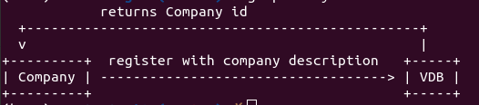
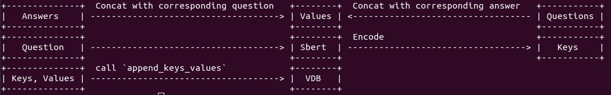
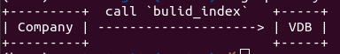
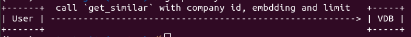

# Vector Database Manual

## Operations

register(description: string)

get_similar(id: u32, q: Vec\<f32\>, limit: i32 )

append_keys_values(id: u32, keys: Vec\<Vec\<f32\>\>, values: Vec\<String\>)

build_index(id: u32)

## Goals

### Register a vector database to use



The company id will be used in `build_index`, `append_keys_values` and `get_similar` to identity which company you are interacting with.

### Insert new questions and answers

keys are a list of vector in size of EMBDDING_SIZE, EMEBEDDING_SIZE here is 768, which is the length of output of sbert(in browser)  after processing a sentence. 



### Build index

This step must be done after inserting a set of keys and values, or those keys and values won't be able to queried by users. 



### Query(Get similar ones)

This step is usually for normal users, so this interface is also permissionless.




## Use case - use with a LLM

1. feed company description to LLM in template 

```
Please answer users' questions base on the company description: <Description>
```

2. encode user question into embedding(use sbert)
3. query vdb using `get_similar_ones`, it will return similarity value along with question-answer-pairs. 
4. feed LLM with template:

```
Here we have a set of existing similar questions:
<question-answers(values)-1>
<question-answers(values)-2>
...
<question-answers(values)-limit>
Please answer question <User Question>
```

5. Get answer from LLM